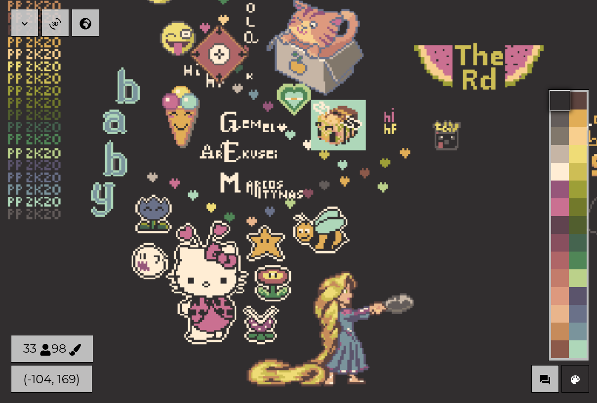

# PixelPlanet.fun

Official  repository of [pixelplanet.fun](http://www.pixelplanet.fun).


Just to the 2nd anniversary of r/space, pixelplanet takes pixelgames to a new level. Place pixels, create pixelart and fight faction wars on pixelplanet.fun.
Pixelplanet is a 65k x 65k large canvas that is a map of the world and can also be seen as 3d globe, you can place pixels where ever you want, build an island, take over another country with a flag or just create pixelart.
30 well chosen colors (decided by polls within the community) are available and you can place a pixel every 3s on an empty space, and 5s on an already set pixel. But pixels can be stacked up to a minute, so you don't have to wait every time.

Pixelplanet receives regular updates and launches events, like a zero second cooldown day on r/place anniversary. We are driven by our community, because placing pixels is more fun together.

Controls:
W, A, S, D, click and drag or pan: Move
Q, E or scroll or pinch: Zoom
Click or tab: Place Pixel



## Build
### Requriements
- [nodejs environment](https://nodejs.org/en/)
- [yarn](https://yarnpkg.com/lang/en/docs/install/#debian-stable)
- (optional) [babel-cli](https://www.npmjs.com/package/babel-cli) (`sudo npm install --global babel-cli`)

### Building
Make sure that you have rights to g++ (if not, run as root and then `chown username:username -R .` after build)

```
yarn install
yarn run build --release
```
All needed files to run it got created in `./build`
#### Note:
If yarn install fails with "unable to connect to github.com" set:
```
git config --global url.https://github.com/.insteadOf git://github.com/
```

## Run
### Requriements
- nodejs environment with [npm](https://www.npmjs.com/get-npm)
- (optional)[babel-cli](https://www.npmjs.com/package/babel-cli) (`npm install -g babel-cli`)
- [pm2](https://github.com/Unitech/pm2) (`npm install -g pm2`) as process manager and for logging
- [redis](https://redis.io/) as database for storgìng the canvas
- mysql or mariadb ([setup own user](https://www.digitalocean.com/community/tutorials/how-to-create-a-new-user-and-grant-permissions-in-mysql) and [create database](https://www.w3schools.com/SQl/sql_create_db.asp) for pixelplanet) for storing additional data like IP blacklist

### Configuration
Configuration takes place in the environment variables that are defined in ecosystem.yml

#### Neccessary Configuration

| Variable       | Description              |  Example                |
|----------------|:-------------------------|------------------------:|
| HOSTURL        | URL of the canvas        | "http://localhost"      |
| ASSET_SERVER   | URL for assets           | "http://localhost"      |
| PORT           | Port                     |  80                     |
| REDIS_URL      | URL:PORT of redis server | "http://localhost:6379" |
| MYSQL_HOST     | MySql Host               | "localhost"             |
| MYSQL_USER     | MySql User               | "user"                  |
| MYSQL_PW       | MySql Password           | "password"              |
| MYSQL_DATABASE | MySql Database           | "pixelpladb"            |

#### Optional Configuration

| Variable          | Description                           | Example     |
|-------------------|:--------------------------------------|-------------|
| USE_PROXYCHECK    | Check users for Proxies               | 0           |
| APISOCKET_KEY     | Key for API Socket for SpecialAccess™ | "SDfasife3" |
| ADMIN_IDS         | Ids of users with Admin rights        | "1,12,3"    |
| RECAPTCHA_SECRET  | reCaptcha secret key                  | "asdieewff" |
| RECAPTCHA_SITEKEY | reCaptcha site key                    | "23ksdfssd" |
| RECAPTCHA_TIME    | time in minutes between captchas      | 30          |
| SESSION_SECRET    | random sting for expression sessions  | "ayylmao"   |

Notes:

- to be able to use USE_PROXYCHECK, you have to have an account on proxycheck.io or getipintel or another checker setup and you might set some proxies in `src/proxies.json` (before building) that get used for making proxycheck requests. Look into `src/isProxy.js` to see how things work, but keep in mind that this isn't neccessarily how pixelplanet.fun uses it.
- Admins are users with 0cd and access to `./admintools` for image-upload and whatever
- You can find out the id of a user by looking into the logs (i.e. `info: {ip} / {id} wants to place 2 in (1701, -8315)`) when he places a pixel or by checking the MySql Users database

#### Social Media

| Variable              | Description              |
|-----------------------|:-------------------------|
| DISCORD_INVITE        | Invite to discord server |
| DISCORD_CLIENT_ID     | All                      |
| DISCORD_CLIENT_SECRET | those                    |
| GOOGLE_CLIENT_ID      | values                   |
| GOOGLE_CLIENT_SECRET  | are                      |
| FACEBOOK_APP_ID       | for                      |
| FACEBOOK_APP_SECRET   | login                    |
| VK_CLIENT_ID          | with                     |
| VK_CLIENT_SECRET      | Social                   |
| REDDIT_CLIENT_ID      | Media                    |
| REDDIT_CLIENT_SECRET  | Accounts                 |

Note:

- The HTML for SocialMedia logins is in src/componets/UserAreaModal.js , delete stuff from there if you don't need it
- The HTML for the Help Screen is in src/components/HelpModal.js

Canvas specific configuartion like colors and cooldown is in `src/canvases.json` for all canvases.
The CanvasSize is expected to be a power of 4 (4096, 16384, 65536,...) and not smaller than 256.
bcd is base cooldown for unset pixels, pcd is cooldown for placing on top of others, cds is stacktime, req is the requirement to be allowed to set on canvas in total pixels placed. All the cooldown values are in ms.
The default configuration values can be seen in `src/core/config.js` and for the canvases in `src/core/constats.js`

### Running

1. Make sure that mysql and redis are running
3. Start with 
```
pm2 start ecosystem.yml
```
Note: It might be neccessary to change the charset and collate of the sql colum names of table Users to support special character names, which can be done with the SQL command:
```
ALTER TABLE Users CONVERT TO CHARACTER SET utf8mb4 COLLATE 'utf8mb4_unicode_ci';
```

### Logging
logs are in ~/pm2/log/, you can view them with
```
pm2 log web 
```
you can flush the logs with 
```
pm2 log flush
```

### Stopping
```
pm2 stop web
```

### If using Cloudflare
In order to get the real IP and not use the cloudflare Proxy IP for placing pixels, we filter those out. The cloudflare IPs are in src/utils/cloudflareip.js and used in src/utils/ip.js. If for some reason cloudflare ads more IPs to it, you can see them at https://www.cloudflare.com/ips/ and add them.
If you use any other Reverse Proxy, you can define it's IPs there too.

### Auto-Start
To have the canvas with all it's components autostart at systemstart,
enable mysql, redis (and probably nginx if you use it) according to your system (`systemctl enable ...`)
And then setup pm2 startup with:
```
pm2 startup
```
(execute as the user that is running pixelplanet)
And follow the printed steps if needed. This will generate a systemctl service file `/etc/systemd/system/pm2-pixelplanet.service` and enable it. You will have to run `pm2 save` while the canvas is running to let pm2 know what to start.
To make sure that mysql and redis are up when pixelplanet starts, edit this service file and modify the lines:
```
Wants=network-online.target
After=network.target mysql.service redis.service
```

### Development

Install packages that are just required for building with `yarn add --dev` others with `yarn add`
